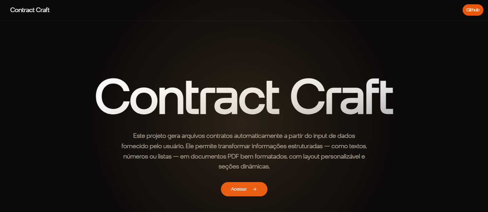

<a href="https://github.com/whosramoss/nextjs-contract-craft">
  
  <h1 align="center">nextjs-contract-craft</h1>
</a>

<p align="center">
  Automatically generate PDFs from user data
</p>

<div align="center">
  
  
  
  
  
  <br/>
  
  
  
</div>
<br/>

<br/>

## How to install

```bash
  # Clone the project
  git clone https://github.com/whosramoss/nextjs-contract-craft/

  # Go to the project directory
  cd nextjs-contract-craft

  # Install dependencies
  npm install

  # Start the server
  npm run dev

```

## Contributing

If you want to contribute to `nextjs-contract-craft`, please make sure to review the [contribution guidelines](https://github.com/whosramoss/nextjs-contract-craft/blob/master/CONTRIBUTING.md). This project makes use of [GitHub issues](https://github.com/whosramoss/nextjs-contract-craft/issues) for
tracking requests and bugs.

## License

MIT License. [LICENSE](./LICENSE)

## Author

Gabriel Ramos ([@whosramoss](https://github.com/whosramoss))
